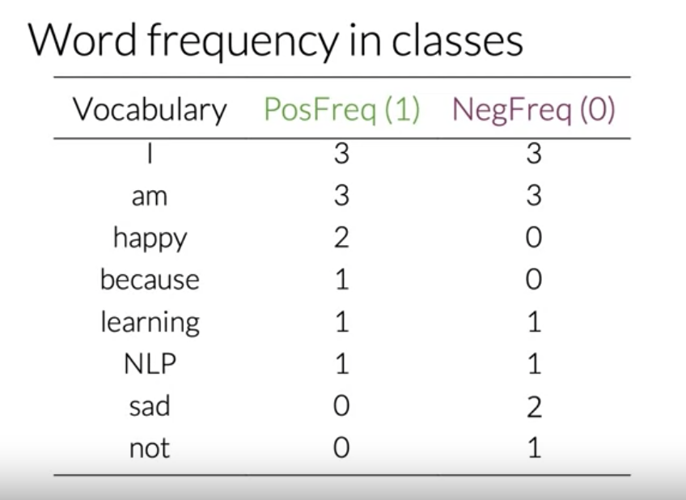

# Supervised ML & Sentiment Analysis

## Overview
```
Text --> X --> Train LR --> Classify --> Positive: 1
```

## Represent text as a vector
### Build upon vocabulary
>"I am Happy because I am learning NLP"
--> [I, am, happy, ...]
--> [1,1,1,0,...] (1 represent present, 0 represent absent)

Length of the vector equals to $|V|$ (size of the vocabulary). As $V$ gets larger, the vector becomes more sparse. Furthermore, we end up having many more features (since we are considering the whole vocabulary), this could result in large training time and large prediction time.

### Use word frequency as features
- Separate positive and negative tweets
- Count the word frequency in positive and negative tweets --> positive/negative frequencies 

$$
X_m = [1, \sum_{w}freqs(w,1), \sum_{w}freqs(w,0)]
$$

This way, the tweet would be represented as a vector of length 3

## Preprocess the text
- Remove stop words and punctuations from the tweets
- Stemming (convert to base stem) and lowercasing


